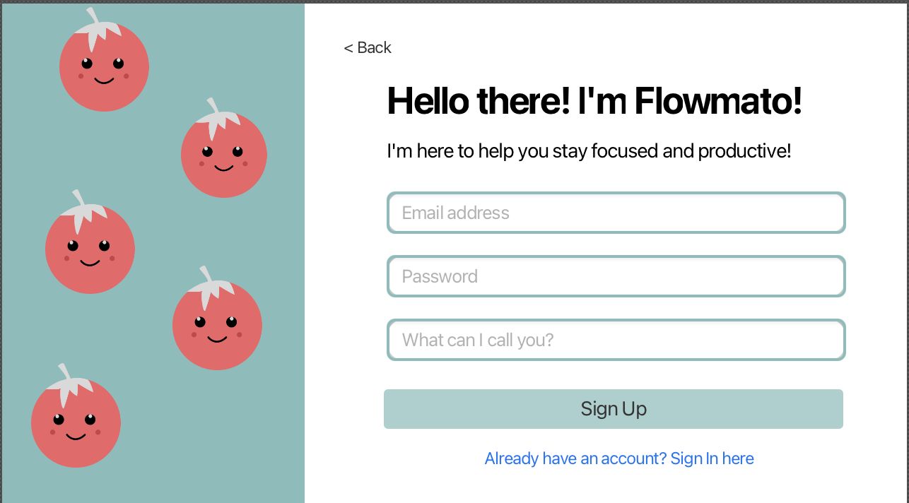

  

# Introducing Flowmato

Effectively managing time and maintaining focus are challenges that resonate with almost everyone. From students grappling with study schedules, to industry professionals juggling multiple projects at once, even everyday tasks can be a struggle for many people. The need for a structured approach to time management is universal. Recognising this need, we introduce *Flowmato*, a project that adopts the Pomodoro technique and augments it with more functionality, elevating it into a more versatile and effective time management tool.

## Flowmato objectives

- **Enhance Productivity**: Utilise the Pomodoro technique to help users focus on tasks in short bursts, leading to increased productivity.
- **Minimise Distractions**: During each Pomodoro, ensure that distractions are minimised.
- **Boosts Focus**: Breaks tasks into intervals with breaks to prevent mental fatigue, eye strain etc...
- **Tomatoes**: For maximum efficiency.

---

  Launch → Register/Sign in → Set timer → Complete Tasks Productively

---

## Flowmato Features

- **Minimal Colour Palette**: A soothing teal and white gradient enhances focus and tranquility, perfect for the Pomodoro Technique.
- **Easy customisation**: Allows user to adjust time of pomodoro session, short breaks and long breaks.
- **Focus Music**: Features ambient, originally composed tunes that promote concentration and focus.
- **Tomoato Analytics**: Be able to track completed pomodoros, total focus and short break time for insights on user patterns.
- **Achievements**: Users can achieve certain badges based on different milestones.

## Color Palette

-  `#8FBCBB`
-  `#FFFFFF`

## Flowmato App Preview

  
   
  

## Important Links

* [Github Repo](https://github.com/nat-mason/The-Percolators) 
* [Trello Board](https://trello.com/b/HSAntZDo/the-percolators)

## Who are the Percolators?

* **Nathaniel Mason** - *Project Manager* - nat-mason

  > Hello Nat test :)

* **Jacob Gee** - *Team Leader/Designer* - Voltadox

  > Hello I am Jake, the percolators are super cool!

* **Maanvi Gharge** - *Lead Designer* - Maanvigharge

  > Hey I'm Maanvi! We're one crazy team but the best!

* **Nell Yi** - *Developer* - dizkneelande

  > i use arch linux btw

* **Jozef Kowalski** - *Developer* - Pirateness

  > [object Object]

## Inspiration: Pomodoro Technique

[Wikipedia](https://en.wikipedia.org/wiki/Pomodoro_Technique)

The **Pomodoro Technique** is a [time management](https://en.wikipedia.org/wiki/Time_management) method developed by Francesco Cirillo in the late 1980s. It uses a [kitchen timer](https://en.wikipedia.org/wiki/Kitchen_timer) to break work into intervals, typically 25 minutes in length, separated by short breaks. Each interval is known as a *pomodoro*, from the Italian word for tomato, after the tomato-shaped kitchen timer Cirillo used as a university student.

[Apps](https://en.wikipedia.org/wiki/Application_software) and websites providing timers and instructions have widely popularized the technique. Closely related to concepts such as [timeboxing](https://en.wikipedia.org/wiki/Timeboxing) and [iterative and incremental development](https://en.wikipedia.org/wiki/Iterative_and_incremental_development) used in software design, the method has been adopted in [pair programming](https://en.wikipedia.org/wiki/Pair_programming) contexts.

## Description

**The original technique has six steps**:

1. Decide on the task to be done.
2. Set the Pomodoro timer (typically for 25 minutes).
3. Work on the task.
4. End work when the timer rings and take a short break (typically 5–10 minutes).
5. Go back to Step 2 and repeat until you complete four pomodoros.
6. After four pomodoros are done, take a long break (typically 20 to 30 minutes) instead of a short break. Once the long break is finished,  return to step 2.

For the purposes of the technique, a *pomodoro* is an interval of work time.

Regular breaks are taken, aiding [assimilation](https://en.wikipedia.org/wiki/Constructivism_(philosophy_of_education)#Individual). A 5-minute break separates consecutive pomodoros. Four pomodoros form a set. There is a longer 20–30-minute break between sets.

A goal of the technique is to reduce the effect of internal and external interruptions on [focus](https://en.wikipedia.org/wiki/Focus_(cognitive_process)) and [flow](https://en.wikipedia.org/wiki/Flow_(psychology)). A pomodoro is indivisible; when interrupted during a Pomodoro, either  the other activity must be recorded and postponed (using the *inform – negotiate – schedule – call back* strategy) or the pomodoro must be abandoned.

After task completion in a Pomodoro, any remaining time should be devoted to activities, for example:

1. Review your work just completed (optional)
2. Review the activities from a learning point of view (ex: What  learning objective did you accomplish? What learning outcome did you  accomplish? Did you fulfill your learning target, objective, or outcome  for the task?)
3. Review the list of upcoming tasks for the next planned pomodoro time blocks, and start reflecting on or updating them.

